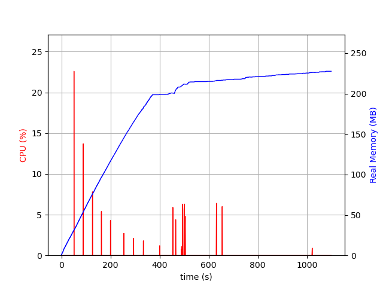

# MQTT - FUNCIONAMENTO GERAL

O funcionamento geral do programa pode ser entedido com o seguinte esquema de
ciclo de vida:

1. Servidor escute por conexões na porta especificada
2. Ao receber conexão, o processo servidor é bifurcado
3. Processo pai continua com o papel de servidor do passo 1
4. Processo filho lida com esta conexão particular

Neste esquema, o papel do processo pai é minímo, visto que apenas espera por
conexões. A lógica do MQTT está no processo filho, o qual iremos analisar a
seguir.

# MQTT - CONNECT packet

Após aceitar a conexão, devemos processar os pacotes MQTT.
O primeiro pacote de uma conexão MQTT é do tipo CONNECT e deve
satisfazer os seguintes requirementos:

- tem 14 bytes de tamanho
- MQTT Control Packet Type é CONNECT
- Remaining Length é 12
- Protocol Name é MQTT em UTF8
- Protocol Level é 3.1.1

Se o pacote recebido satisfazer isto, então enviamos um CONNACK packet.
Do contrário, abortamos a conexão enviando um DISCONNECT packet.

# MQTT - Cliente SUBSCRIBER ou PUBLISHER

O segundo pacote deve ser um SUBSCRIBE request ou PUBLISH request, caso
contrário a conexão é abortada. Isto irá depender dos primeiros 4 bits
recebidos, que contém o MQTT Control Packet Type.

Após processar o tipo de pacote, é necessário decodificar o Remaining Length,
que pode ocupar de 1 à 4 bytes. O Remaining Length determina o tamanho do resto
do pacote em bytes (Variable Header + Payload)

A partir daí, a lógica para lidar com o cliente será diferente se ele é
um subscriber ou publish

# MQTT - Publish-Subscribe

Para implementar o modelo *Publish-Subscribe* utilizei pipes. O processo
*publisher* irá escrever sua mensagem nas pipes dos clientes cujo tópico dá
*match* no tópico publicado.

Os processos dos *subscribers* estarão ouvindo nas suas respectivas pipes e,
após receber a mensagem, encapsularão a mensagem em um Publish packet para enviar
de volta para a conexão.

A questão que fica é:

*Como o processo publisher vai obter acesso às pipes ?*

Visto que os processos são independentes e nunca se comunicaram antes, é
necessário um modo para que o *publisher* ache as pipes.

# MQTT - Finding pipes

A solução que encontrei para a questão anterior foi a seguinte:

Criar um diretório temporário para guadar todos os arquivos da
instância atual do servidor MQTT. O diretório tem nome aleatório para
evitar colisões e é criado antes de aceitar qualquer conexão, logo todos os
procesos filhos sabem qual é o nome deste diretório, chamado `app_dir`.

Dentro do `app_dir`, são criados um diretório para cada tópico, chamado
`topic_dir`. O nome de um `topic_dir` é igual ao hash do tópico utilizando
SHA-256 (para isso, usei uma biblioteca externa descrita no README).

Dentro de um `topic_dir` estarão as pipes de todos os clientes escutando
naquele tópico. Quando um *subscriber* se conecta, é criado uma pipe para ele
no diretório `topic_dir` e o cliente fica esperando mensagens nesta pipe.

# MQTT - Publisher

Quando um *publisher* se conecta, ele procura pelo diretório `topic_dir`, e se
o diretório existe, então o publisher escreve sua mensagem em todas as pipes
deste contidas neste diretório. A biblioteca `<dirent.h>` é usada para iterar
sobre os arquivos do diretório.

Observe que o *publisher* e os *subscriber* não se comunicaram para
descobrir o nome das pipes. O que possibilitou o contato inicial foi o fato de
`app_dir` (disponível desde o ínicio do programa) e `topic_dir` (nome
determinístico) serem conhecidos por ambos processos.

# MQTT - Publisher

Dito isso, já resumimos toda a lógica por trás do *publisher*. Visto que `QoS=0`,
a única coisa que é necessário fazer é processar o pacote do *publisher*, extrair
a mensagem e enviar esta mensagem para as pipes dos *subscribers*.

A partir daí, é dever dos processos *subscribers* pegar a mensagem recebida,
encapsula-lá em um pacote MQTT Publish, e então enviar o pacote para o cliente.

Portanto, após ter escrito a mensagem em todas as pipes, terminamos de lidar
com o *publisher*.

# MQTT - Subscriber

Após processar o pacote do *subscriber*, são necessários realizar duas tarefas
basicamente:

- Esperar por mensagens na pipe e, quando recebê-las, encaminha-las para os
- clientes Esperar por pacotes do cliente e processá-los de acordo

Para isto, criei um outro processo filho utilizando `fork`. O processo pai lida
com os pacotes do cliente e o processo filho lida com a pipe.

# MQTT - Subscriber

## processo pai

Os únicos pacotes válidos que podemos esperar do cliente são PING request e
DISCONNECT request. No primeiro caso enviamos um PING response, e no segundo
caso encerramos a conexão de modo limpo. Se recebermos outro tipo de pacote, o
que é inválido, a conexão é abordada.

## procesos filho

Iremos esperar mensagens na pipe e, após recebidas, construir um MQTT Publish
packet e enviar para o cliente. Entraremos em loop infinito e ficaremos
repetindo este procedimento eternamente até a conexão ser encerrada.

# MQTT - Subscriber

Como há dois processos lidando com o mesmo cliente, é necessário que o processo
filho saiba quando a conexão será terminada (ela só será terminada pelo
processo pai quando este receber um DISCONNECT request ou abortar a conexão).

Para tanto, criei o subdiretório `active_clients` dentro do diretório
`app_dir`. Toda vez que um *subscriber* inicia a conexão, é criado um arquivo
vazio em `active_clients` para indicar que este cliente está ativo. Portanto,
podemos saber quais são todos os clientes ativos consultando este diretório.

Quand o *subscriber* for desconectado pelo processo pai, seu arquivo em
`active_clients` é deletado por ele. O processo filho irá consultar se este
arquivo existe antes de construir o MQTT Publish packet. Se o arquivo existe,
então pode construir e enviar o pacote. Se não existe, então o processo filho é
encerrado e a pipe é deletada.

# MQTT - Desempenho

Toda lógica por trás do programa foi explicada. Podemos agora focar na análise
de desempenho do programa.

Para isto, utilizei o programa `psrecord` disponível no [github
astrofrog/psrecord](https://github/astrofrog/psrecord), que pode ser instalado
com:

`pip install psrecord`

O programa em si já toma conta de coletar vários dados estatísticos para
elaborar gráficos, de forma que muito do trabalho a ser feito pode ser
automatizado e deixado para que `psrecord` faça isso por nós.

# MQTT - Desempenho

No primeiro tipo de análise, foi medido o desempenho em termos de uso
de CPU e memória do servidor em três condições:

1. rodando sozinho, sem clientes conectados.
2. rodando com 100 clientes subscribers conectados enquanto a cada segundo
um novo cliente publisher posta uma mensagem num tópico existente
3. rodando do mesmo jeito anteriro, mas com 1000 clientes

Os resultados seguem nos próximos slides

# MQTT - Desempenho com 0 clientes

# MQTT - Desempenho com 100 clientes

# MQTT - Desempenho com 1000 clientes

# MQTT - Análise do desempenho

Com 0 clientes, como era de se imaginar, o desempenho foi constante e baixo
visto que o servidor apenas fica esperando por conexões no socket.

Com 100 clientes simultâneos, vemos que o uso da memória aumenta de forma
linear inicialmente, pois novos clientes estão se inscrevendo em tópicos. Após
os 100 clientes se inscreverem, temos um uso de memória constante (lembrando
que a cada 1 segundo um novo publisher publica uma mensagem, então a demanda
nunca para).

O uso da CPU cai também, visto que muitos subscribers irão ficar a toa
esperando por mensagens e poucos vão estar realizando alguma computação (tal
como processar o pacote).

# MQTT - Análise do desempenho

Uma coisa que vemos no gráfico é a presença de picos de uso de CPU seguidos
de intervalos onde o uso do CPU é quase nulo. Isto é devido ao fato de que
medir o uso da CPU de vários processos (incluindo os filhos) é complicado e o
software `psrecord` faz a medida em intervalos de tempo maiores e ainda não
é completamente funcional.

Já com 1000 clientes, após estabilizar o uso da memória, ele volta novamente
a crescer. Há também picos de uso de CPU perto um dos outros e um intervalo
sem picos.

# MQTT - Análise do desempenho

Isto é devido à alguns problemas que tive realizando o teste com 1000 clientes.
Conforme instruído, utilizei virtualização para simular rodar os clientes em máquinas
diferentes.

Após uns 700 clientes, o Docker começou a ficar lento e dar alguns problemas:
clientes já conectados caíam sem intervenção e o Docker reiniciava eles. Do ponto de vista
do servidor MQTT, era como se um cliente existinte tivesse perdido a conexão e um novo
cliente tivesse iniciado uma nova conexão.

Escolhi usar o Docker porque containers são mais leves do que VMs como
VBox e Qemu, mas mesmo assim 1000 containers foi muito para meu computador aguentar.

# MQTT - Análise do desempenho

Apesar dos alguns obstáculos na análise da conexão de 1000 clientes,
creio que no fim das contas os experimentos nos dão uma visão geral do desempenho
do servidor MQTT.

O servidor tem desempenho constante com 0 clientes, e este é de fato o comportamento
esperado já que não faz nenhum processamento. O uso de CPU e memória é linearmente
proporcionalmente ao número de clientes conectados, como visto nos gráficos.

Isto faz sentido visto que bifurcamos o processo original em processos iguais
em termos de memória usada e poder computacional necessário para processar
recebimento e envio de pacotes.

# MQTT - Conclusão

Tendo em vista a análise feita, concluo que o desempenho do servidor,
que é linear, está muito bom em termos de uso de CPU e memória.

O servidor, apesar de simples, tem as funcionalidades básicas para agir como um
broker entre vários clientes.

Não possui autentificação ou QoS, mas é suficiente para providenciar um
ambiente em que algumas centenas de clientes possam publicar e receber
mensagems em tópicos específicos e sem problemas.
